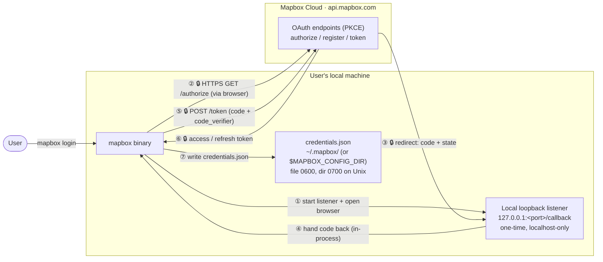
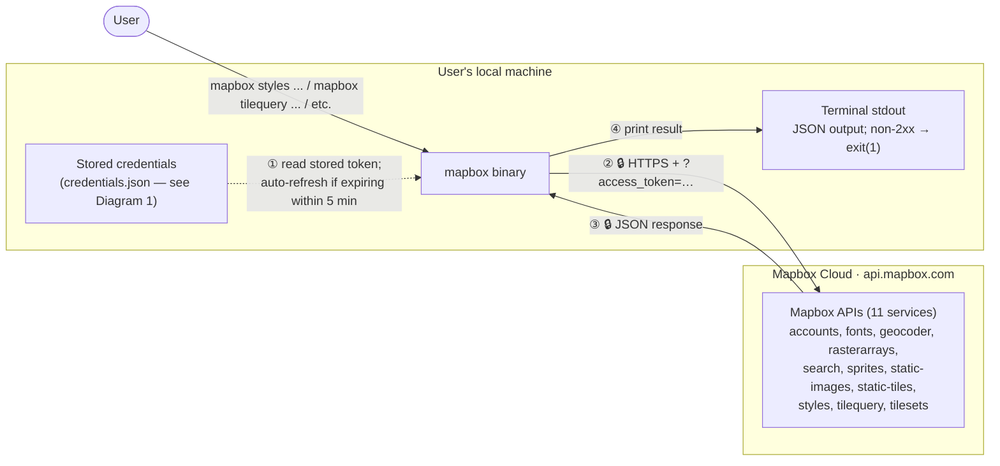
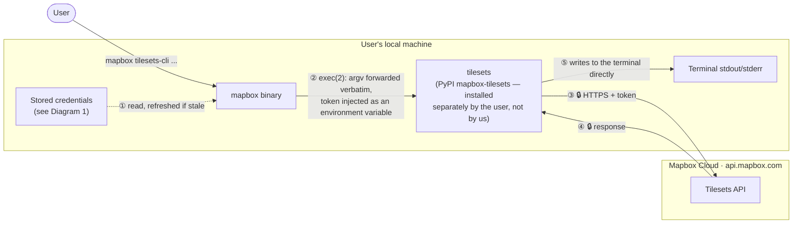

# Architecture & Data Flow

## Scope

This diagram covers `mapbox-cli` and how it connects to Mapbox's cloud
services and to the user's machine. It does not cover how Mapbox's cloud
API services work internally. The CLI has no cloud infrastructure of its
own (no VPC, load balancer, or IAM roles). It is a local client that talks
directly to public Mapbox API endpoints.

## Diagrams

There are three request-response cases that happen at runtime. Each one
crosses trust boundaries differently, so each gets its own diagram.
**Legend** (shared by all three): 🔒 means the arrow crosses the network
(HTTPS/TLS). Arrows without 🔒 stay on the local machine (same process or
same disk, no network). Dashed arrows happen once or in one direction only
(a compile-time embed, or a check done only at startup).

### 1. Login (`mapbox login`) and token storage

Steps ①–⑥ cover dynamic client registration, PKCE
(`code_verifier`/`code_challenge`), `state` validation against CSRF, and the
one-time loopback listener. See `src/auth.rs`.

Step ⑦ is a plain JSON file, not an OS keychain — there is no keychain,
Credential Manager or Secret Service integration in this CLI. `auth.rs`'s
`write_private` is the only thing that writes it:

- The directory — `~/.mapbox`, or whatever `MAPBOX_CONFIG_DIR` names — is
  created and `chmod`ed to `0700` before anything is written into it.
- The contents go to a scratch file beside the target, opened with
  `create_new` and mode `0600`, so the file is owner-only from the instant
  it exists and a symlink planted in its place is never written through.
- The mode is pinned again with `set_permissions` after the write, because
  `open(2)`'s mode is masked by the umask.
- The scratch file is `fsync`ed and then renamed over `credentials.json`, so
  a crash or a concurrent reader never sees a half-written file, and the
  mode of whatever it replaced is irrelevant — a rename swaps in a whole new
  inode.

Two limits follow from that. The `0700`/`0600` hardening is Unix-only; off
Unix the file carries whatever permissions the OS gives it. And on every
platform the token is readable by anything running as the same user — file
permissions are the whole of the protection.

`load_fresh_credentials()` runs on every command, including ones
authenticated via `--token`/`MAPBOX_ACCESS_TOKEN`, so a missing or
unreadable store reports "no stored credentials found" rather than failing
the command.

### 2. Using the stored token to call a Mapbox API

Covers every existing `mapbox <service> <operation>` command (`src/executor.rs`).
The token is read from wherever Diagram 1 stored it. It is refreshed in
place if it's close to expiring, then sent as an `access_token` query
parameter. It is not sent as an `Authorization` header, because that
matches how these APIs have always been called.

The request also carries `User-Agent: mapbox-cli/<version>`. This is how
Mapbox's logs identify this CLI's traffic. `src/http.rs` is the only place
an HTTP client is built, so every request goes through it. Anything added
to that header beyond the version is gated on `MAPBOX_CLI_NO_TELEMETRY`. Nothing
is added today.

### 3. The Tilesets CLI proxy (`mapbox tilesets-cli`)

Implemented in `src/tilesets_cli.rs`. Everything after `mapbox tilesets-cli`
is passed to the `tilesets` binary unchanged, including flags. So
`mapbox tilesets-cli --help` prints the Tilesets CLI's own help. If
`tilesets` isn't installed, the CLI prints install instructions instead of
running it.

Three points matter here:

- **The token is passed by environment variable, never by argv.** `tilesets`
  looks for its token in this order: the `--token` flag, then
  `MAPBOX_ACCESS_TOKEN`, then `MapboxAccessToken`. We set the
  `MAPBOX_ACCESS_TOKEN` environment variable on the child process. Putting
  the token in argv instead would expose it to every other local user
  through `ps`, so we rejected that option. Nothing is injected at all if
  the environment already has a token under either name `tilesets` reads.
- **Token precedence follows the same order as the rest of the CLI: flag,
  then environment, then stored credentials.** The environment variable
  stays an override, because it's the only option available to a script,
  container, or CI job, and because comparable tools use the same order.
  This has a cost: a token left in a shell profile can shadow a later
  `mapbox auth login` indefinitely, showing up as a plain `Not found` from
  the API instead of a clear auth error. We reduce that risk with a warning
  when the environment token and the stored login belong to different
  accounts, rather than by changing the order. An explicit `--token` given
  after the subcommand name is still forwarded and still wins, since
  `tilesets` prefers its own flag.
- **No new network boundary.** On this path, `mapbox` makes no requests of
  its own except a token refresh, which is the same OAuth exchange already
  covered by Diagram 1. Every other network crossing shown is one
  `tilesets` would make anyway. On Unix, the proxy uses `exec` instead of
  spawning a subprocess, so this process is *replaced* by the child. No
  wrapper process is left holding a token in memory.

A stored token now drives the Tilesets API here, so its scope matters. A
`mapbox auth login` token carries `tilesets:list` and `tilesets:write`,
which cover this in practice.

One thing is not done, and won't be: `mapbox` does **not** install
`tilesets`. It only checks whether the binary is reachable, and prints
install instructions if it isn't.
